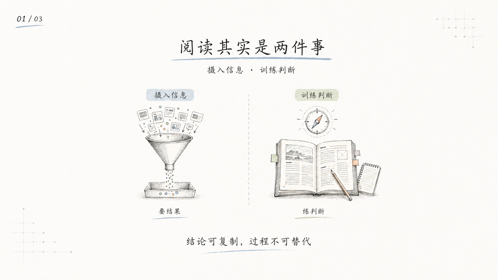
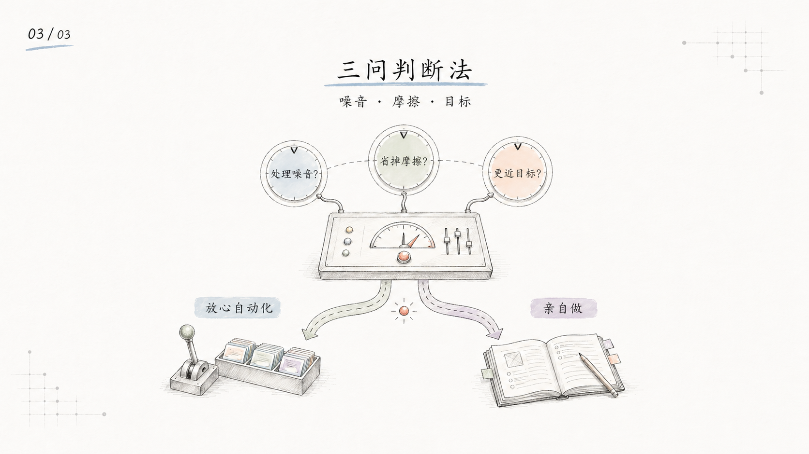

# doc-to-sketch

> 把本地文档或飞书文档内容，转换为中文手绘技术解释风格的 PPT-style 页面图。
>
> AI Skill + prompt 资产 | 21:9 封面 | 16:9 正文配图 | PNG 输出 | 飞书文档输入（开发中）

> **📌 Fork 自 [ian-handdrawn-ppt](https://github.com/helloianneo/ian-handdrawn-ppt) by Ian。**

---

## 这个仓库是什么

doc-to-sketch 是一个把文档内容转换为**中文手绘技术解释图**的 AI Skill。

基于 [ian-handdrawn-ppt](https://github.com/helloianneo/ian-handdrawn-ppt) 的视觉 DNA 和叙事规划系统，当前支持：

- **本地内容输入**：Markdown、DOCX、PDF、PPTX、纯文本
- **飞书文档 URL 输入**：通过轻量脚本获取飞书文档内容（开发中）
- **多宿主安装**：Codex CLI（当前可用）；Claude Code（计划支持，待验证）

---

## 适合谁用

特别适合：

- 写中文技术文章，需要封面图和正文配图的人
- 做课程、训练营、工作坊，需要解释复杂概念的人
- 想把长文、提纲、讲稿变成视觉化页面的人
- 用 Codex 做内容生产，希望减少“模板 PPT 味”的人
- 想让 AI 先规划页面叙事，再生成图像的人

不适合：

- 想要可编辑 PPTX 源文件的人
- 想要自动导出 PDF / PPTX 文件的人
- 想要复杂动效、交互式网页或矢量图的人
- 想把大量正文塞进一张图里的人

---

## 它会产出什么

默认输出：

- 21:9 文章封面图
- 16:9 正文插图 / 标准页面图
- 多页 contact sheet
- 简短 slide blueprint summary

默认不输出：

- 可编辑 PPTX
- image-based PPTX
- PDF
- Keynote 文件
- HTML / SVG / canvas 版本

---

## 视觉风格

这个 skill 默认使用 Ian 的中文手绘技术解释风格：

- 近白纸底，不发黄
- 无整页边框
- 细手绘线条和轻微铅笔排线
- 淡蓝、鼠尾草绿、浅桃、淡紫标记
- 中央图小而精，保留大量空白
- 标题克制，不做大字海报
- 中文文字短、少、可检查
- 人物很少，最多一个小读者/工程师角色

参考图在：

```text
ian-handdrawn-ppt/assets/reference-handdrawn-article-illustration-style.png
```

> 注：目录重组后路径将变为 `assets/reference-handdrawn-article-illustration-style.png`

---

## 示例效果

下面是原项目 [ian-handdrawn-ppt](https://github.com/helloianneo/ian-handdrawn-ppt) 的示例输出，展示了中文手绘技术解释风格的效果：1 张超宽封面 + 3 张正文解释页。

### 能自动化不等于该自动化


### 阅读其实是两件事



### 自动化该放哪里


### 三问判断法



---

## 安装

克隆仓库：

```bash
git clone https://github.com/evidentloop/doc-to-sketch.git
cd doc-to-sketch
```

> ⚠️ 目录结构正在重组：Skill 将从 `ian-handdrawn-ppt/` 子目录提升到根级。以下安装方式仍可用，但后续会简化。

**Codex CLI 安装：**

```bash
mkdir -p "${CODEX_HOME:-$HOME/.codex}/skills"
cp -R ./ian-handdrawn-ppt "${CODEX_HOME:-$HOME/.codex}/skills/"
```

**Claude Code 安装（重组完成后可用）：**

```bash
# 目录重组完成后，以下命令将可用（当前尚未验证）
npx skills add evidentloop/doc-to-sketch
```

安装后，在 Codex 里使用：

```text
Use $ian-handdrawn-ppt 把这篇文章做成 1 张封面图 + 3 张正文配图。
```

---

## 怎么用

### 文章封面 + 正文配图

```text
Use $ian-handdrawn-ppt 把下面这篇文章做成 1 张 21:9 中文封面图 + 3 张 16:9 正文配图。
风格保持中文手绘技术解释图，文字尽量短，每张图只表达一个观点。

<粘贴文章>
```

### 课程课件页

```text
Use $ian-handdrawn-ppt 把这份课程大纲整理成 8 页中文手绘技术课件图。
面向有基础的新手，每页一个核心概念，输出 slide-by-slide blueprint，然后生成最终 PNG 页面图。

<粘贴课程大纲>
```

### 只规划，不生图

```text
Use $ian-handdrawn-ppt 先不要生图。
请把这篇内容规划成一套 10 页左右的中文手绘技术 PPT-style image deck。
每页给出标题、主旨、版式 archetype、可见文字和图像 brief。

<粘贴素材>
```

更多示例见 [examples/prompts.md](examples/prompts.md)。

---

## 工作流程

这个 skill 的流程是：

1. 读取材料：文章、Markdown、PDF、DOCX、PPTX、课程大纲、讲稿或粗略想法
2. 做 intake：判断主题、受众、场景、目标、核心论点和素材充分度
3. 规划叙事：选择教学、说服、报告、产品解释或知识卡片结构
4. 选择页面 archetype：封面隐喻、左右对比、流程、循环、分类、矩阵、总结等
5. 锁定视觉 DNA：统一纸底、标题、页码、线条、色彩、图形尺度
6. 每页单独写图像 prompt：包含页面角色、主旨、构图和 `Required text only`
7. 生图并检查：中文文字、画幅、风格一致性、是否漂黄、是否过度模板化
8. 多页生成 contact sheet，最后交付 PNG 页面图

---

## 目录结构

**当前结构：**

```text
.
├── README.md
├── LICENSE
├── NOTICE.md
├── examples/
│   ├── images/
│   │   ├── cover-automation-boundary.png
│   │   ├── page-01-reading-two-things.png
│   │   ├── page-02-where-to-automate.png
│   │   └── page-03-three-question-method.png
│   └── prompts.md
└── ian-handdrawn-ppt/          ← 当前 Skill 安装入口
    ├── SKILL.md
    ├── assets/
    │   ├── reference-handdrawn-article-illustration-style.png
    │   └── theme-tokens.json
    └── references/
        ├── intake.md
        ├── narrative-planning.md
        ├── output-quality.md
        ├── prompt-patterns.md
        ├── slide-archetypes.md
        └── visual-dna-v6.md
```

**目标结构（Phase 0 完成后）：**

```text
.
├── SKILL.md                    ← 提升到根级
├── references/                 ← 提升到根级
├── assets/                     ← 提升到根级
├── scripts/
│   └── feishu_fetch.py         ← Phase 2 产出
├── examples/
├── README.md
├── LICENSE
└── NOTICE.md
```

安装到 Codex 时，当前使用 `ian-handdrawn-ppt/` 子目录；重组后使用根目录。

---

## 注意事项

- 图片里的中文文字越短越稳定。
- 最好每个页面多生成几次，再从中挑选中文字、构图、语义关系都最稳的一张。
- AI 图像模型可能出现错字、幻觉标签、物体关系错误、风格漂移，不要默认第一张就是最终稿。
- 如果中文渲染失败，应先减少字数并重生。
- 如果画面方向已经正确但文字仍错，可以保留图像方向，再用确定性后处理叠准确中文。
- PPTX/PDF 可以作为输入素材读取，但不是这个 skill 的输出格式。
- 这个 skill 的重点是“内容语义 → 页面叙事 → 手绘解释图”，不是模板套版。

---

## 相关资料

- 原项目: [ian-handdrawn-ppt](https://github.com/helloianneo/ian-handdrawn-ppt) by Ian
- 组织: [evidentloop](https://github.com/evidentloop)

---

## 致谢

本项目的视觉 DNA、叙事规划系统和 prompt 模板基于 **Ian** 的 [ian-handdrawn-ppt](https://github.com/helloianneo/ian-handdrawn-ppt)。

---

## License

MIT License. See [LICENSE](LICENSE).
